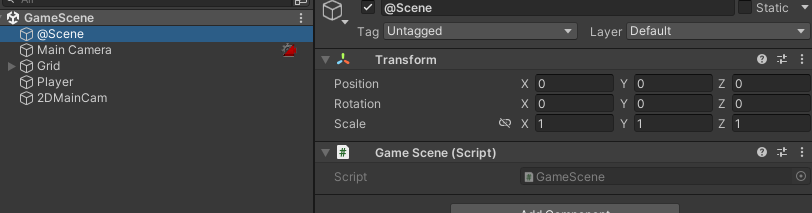

# 게임 기본 구조

## Assets Folder

Assets 폴더 기준 설명

- Resources
    
    이미지, 스프라이트 등 각종 데이터들

    추가된 에셋들 모음집

    혹시나 추가된 큰 에셋이 있다면 , **.Ignore로 제외 시켜줘야한다**

- GameSettings
    
    - GameSettings.cs

    게임 이 시작되면 무조건 실행되야 하는 게임매니저 등을 관리할수 있는 스크립트

    - InputSystem.InputActions

    게임 인풋관련 기본적인 인풋액션들 


- Scenes

    각종 게임씬들이 들어갈 곳

- Animations
    
    각종 애니메이션 컨트롤러 및 애니메이션 등의 파일 보관할곳
    
    **(각 오브젝트별로 폴더링 합시다.)**

- Scripts

  스크립트 파일들 들어갈 곳

    - Managers
    
        매니저 들 들어갈곳입니다 현재 게임 매니저와 씬매니저 만들어두었습니다.

    - Player
    
        플레이어 관련 스크립트

    - Monsters
    
        여러 몬스터들 각각 폴더링해서 넣어둡시다.

    - Scenes 
    
        씬 관련 스크립트 모음

        현재 Base 폴더안에 있는 BaseScene.cs 를 기준으로 씬을 만듭니다.
        자세한건 아래에서


**더 필요한 폴더들은 추가하여 만듭시다. 단 폴더링을 잘합시다.**


## 기본 구조

게임이 시작되면 GameSettings 스크립트가 실행됩니다.

```cs
 //게임시작하자마자 아래의 함수를 호출해준다.
    [RuntimeInitializeOnLoadMethod(RuntimeInitializeLoadType.BeforeSceneLoad)]
    private static void Init()
    {

        if (GameManager.Instance == null)
        {
            GameObject gameManager = new GameObject() { name = "GameManager" };
            gameManager.AddComponent<GameManager>();
        }
    }

```

현재는 싱글톤 으로 만들어진 게임매니저를 호출합니다.

또다른 매니저를 추가하고싶다면 

이곳에 인스턴스로 추가해주고 

InitManagers() 메소드에 추가해줍시다.


```cs
    //...중략
    
    //SceneManager
    private static SceneManagerEX sceneManager;
    public static SceneManagerEX Scene { get { return sceneManager; } }
    
    //..중략
    private void InitManagers()
    {

        GameObject dobj = new GameObject() { name = "SceneManagerEX" };
        dobj.transform.SetParent(transform);
        sceneManager = dobj.AddComponent<SceneManagerEX>();

    }
```

위에 처럼 씬매니저를 추가할수도있습니다.


## Scene System

현재 씬은 매우 중요한 구조입니다.

만약 씬을 추가하고싶으면

**SceneDefine 소스에 같은이름**으로 추가하여 사용합니다.

```cs
    public class SceneDefine    
    {
        public enum Scene
        {
            Unknown, // 디폴트 씬
            LoadingScene, // 로딩씬
            TitleScene, // 타이틀 씬 
            GameScene, // 인게임 씬
            EndingScene, // 게임 엔딩 씬 
        }
    }
```

모든 씬들은 BaseScene 을 상속하여 만듭시다

Base Scene은 별거없고 기본 세팅만 해두었습니다..

실제 사용은



위 스크린샷 처럼

각 씬에 빈 오브젝트로 Scene 을 하나만들고 (아무이름이랑 상관없음)

(다른 오브젝트와 차이를 주기위해 @ 표시를 했습니다.)

BaseScene을 상속하는 게임씬 스크리브를 붙혀주면됩니다.

```cs
public class GameScene : BaseScene
{
    protected override void Init()
    {
        base.Init();
        SceneType = SceneDefine.Scene.GameScene; // 현재 씬 저장해주어야합니다.
    }


    public override void Clear()
    {
    }
}
```

제일 중요한건 Init 에 현재 씬을 저장해줍시다.

이걸 기반으로 씬매니저가 돌아갑니다.

